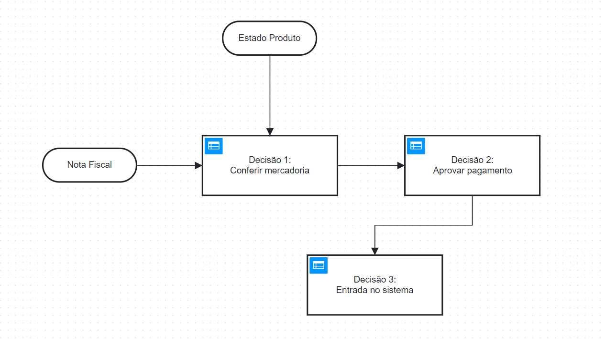
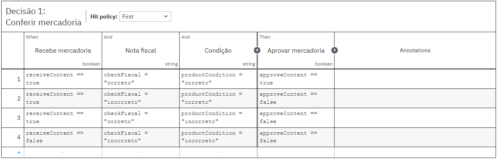
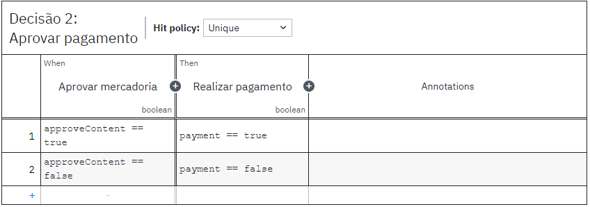
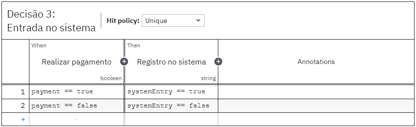

<h1>Decision Model and Notation</h1>

A linguagem DMN (Decision Model and Notation) é uma linguagem de modelagem gráfica usada para representar decisões de negócios de forma clara e compreensível. Ela fornece uma notação visual para descrever as regras e lógica por trás das decisões em um formato fácil de entender tanto para desenvolvedores quanto para usuários de negócios.

<h2>Diagrama</h2>

O diagram representa as decisões que devem ser tomadas no sistema, bem como as entradas que influenciam estas decisões. O diagrama foi desenvolvido utilizando o software Camunda Modeler e será apresentado a seguir.

Imagem 01 - Diagrama DMN

Fonte: Autoria própria.

<h2>Decisão 1</h2>

As decisões são ações tomadas pelo funcionário no sistema. Cada ação possui uma ou mais regras de negócio vinculadas a ela. No caso da primeira ação, é possível visualizar as regras para Conferir a Mercadoria.

Imagem 02 - Conferir

Fonte: Autoria própria.

Regras de negócio:

| Variável | Tipo | Descrição |
| --- | --- | --- |
| receiveContent | boolean | Identifica se a mercadoria foi entregue
| checkFiscal | string | Marca se a nota fiscal está correta ou incorreta |
| productCondition | string | Identifica se a condição do produto está correta ou incorreta |
| approveContent | boolean | Aprovar ou não a mercadoria |

<h2>Decisão 2</h2>

A segunda decisão diz respeito à Aprovação do Pagamento, após a conferência da entrega.

Imagem 03 - Conferir

Fonte: Autoria própria.

Regras de negócio:

| Variável | Tipo | Descrição |
| --- | --- | --- |
| approveContent | boolean | Identifica se a mercadoria foi aprovada |
| payment | boolean | Decide se o pagamento será realizado ou não |

<h2>Decisão 3</h2>

Por fim, a terceira decisão está relacionada ao registro das informações do produto no sistema, após o pagamento.

Imagem 04 - Registrar

Fonte: Autoria própria.

Regras de negócio:

| Variável | Tipo | Descrição |
| --- | --- | --- |
| payment | boolean | Identifica se o pagamento foi realizado ou não |
| systemEntry | boolean | Decide se a compra é registrada no sistema |

